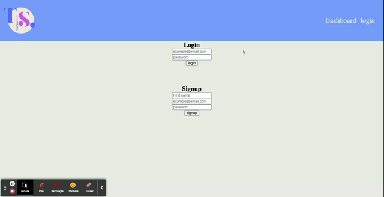

# MVC-Tech-Blog

<h1 align="center">
   
  
</h1>

<h4 align="center">The tech blog spot!</h4>

  <a href="#About">About</a> •
  <a href="#how-to-use">How To Use</a> •
  <a href="#download">Download</a> •
  <a href="#credits">Credits</a> •
  <a href="#Bugs">Bugs</a> •
  <a href="#license">License</a>

## About

This application is designed for people interested in writing blogs about tech. Users can post their blogs. 

## How To Use

Click on the link above. 

## Credits

This is a MERN stack application. I used resources from class. 

## Bugs

I had a difficult time deploying this application on Heroku. I think I have an issue with my delete route that might be preventing the application from running on Heroku. 

## License

MIT

---

> GitHub [@bravlis2](https://github.com/bralvis2) &nbsp;&middot;&nbsp;

